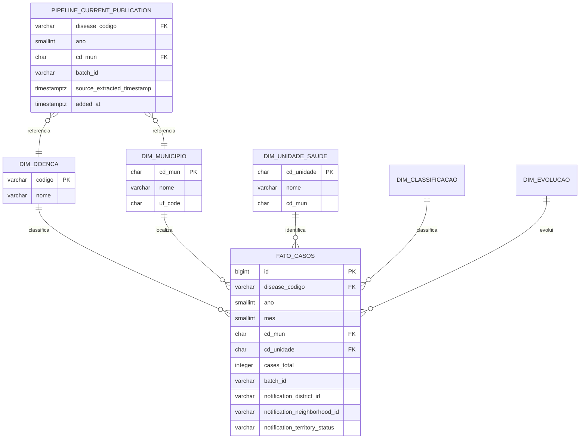

```mermaid
erDiagram
    DIM_DOENCA ||--o{ FATO_CASOS : classifica
    DIM_MUNICIPIO ||--o{ FATO_CASOS : localiza
    DIM_UNIDADE_SAUDE ||--o{ FATO_CASOS : identifica
    DIM_CLASSIFICACAO ||--o{ FATO_CASOS : classifica
    DIM_EVOLUCAO ||--o{ FATO_CASOS : evolui
    PIPELINE_CURRENT_PUBLICATION }o--|| DIM_DOENCA : referencia
    PIPELINE_CURRENT_PUBLICATION }o--|| DIM_MUNICIPIO : referencia

    DIM_DOENCA {
        varchar codigo PK
        varchar nome
    }
    DIM_MUNICIPIO {
        char cd_mun PK
        varchar nome
        char uf_code
    }
    DIM_UNIDADE_SAUDE {
        char cd_unidade PK
        varchar nome
        char cd_mun
    }
    FATO_CASOS {
        bigint id PK
        varchar disease_codigo FK
        smallint ano
        smallint mes
        char cd_mun FK
        char cd_unidade FK
        integer cases_total
        varchar batch_id
        varchar notification_district_id
        varchar notification_neighborhood_id
        varchar notification_territory_status
    }
    PIPELINE_CURRENT_PUBLICATION {
        varchar disease_codigo FK
        smallint ano
        char cd_mun FK
        varchar batch_id
        timestamptz source_extracted_timestamp
        timestamptz added_at
    }
```
